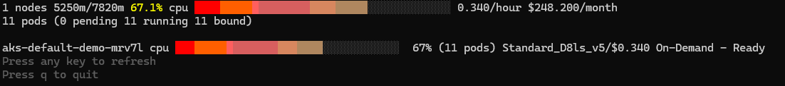
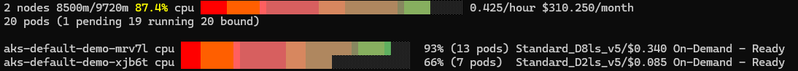

# Understanding and use Nodepool and AKSNodeClass custom resources

In this module, we'll explore NodePools, the fundamental building blocks that define how Karpenter provisions, manages, and optimizes nodes in your AKS cluster.

## What is a NodePool?

As explained in the concepts section, NodePools in Karpenter are custom resources enabling a cluster owner to configure the behavior of Karpenter in the cluster. NodePools:

- Define constraints on what nodes can be provisioned
- Specify how nodes should be managed over time
- Set resource limits and boundaries for scaling

You can have multiple NodePools in a cluster, each with different rules, to accommodate diverse workload needs. This will be explored in module 4.

## NodePool Components

A typical NodePool definition includes:

- **Requirements**: Constraints on what types of nodes can be provisioned (VM SKU families, architectures, etc.)
- **Disruption**: Rules for consolidation and expiration
- **nodeClassRef**: A reference to an existing instance of AKSNodeClass
- **Limits**: (optional) Resource boundaries to control scaling and cost
- **Weight**: (optional) Relative priority when multiple NodePools can serve a pod

## AKSNodeClass Components

An AKSNodeClass typically includes:

- **imageFamily**: The OS image family to use (e.g., Ubuntu2204, AzureLinux)
- **osDiskSizeGB**: (optional) Size of the ephemeral disk in GB
-- **imageVersion**: (optional) Specific version of the OS image that should be deployed - by default all nodes use the latest version of the chosen image
- Additional Azure-specific configurations like accelerated networking settings

## Prerequisites

Before beginning the exercises, ensure you have followed the steps in the setup phase and have:

1. A running AKS cluster with Node Auto Provisioning enabled
2. Kubectl configured to interact with your cluster

First let's create workshop namespace that will be used throughout the workshop.

```bash
# Create workshop namespace
kubectl create namespace workshop
```

## Exercise 1: First NodePool and Scaling

In this exercise, we'll create a sample NodePool with an AKSNodeClass and observe how Karpenter provisions nodes as workloads are deployed.

### Step 1: Deploy a Basic NodePool with AKSNodeClass

In Karpenter, you need to have both a NodePool and an AKSNodeClass. Let's create both resources with the following command:

=== "Bash"
    ```bash
    cat <<EOF | kubectl apply -f -
    --8<-- "assets/yamls/module1/1-nodepool.yaml"
    EOF
    ``` 
=== "PowerShell"
    ```powershell
    $yamlContent = @"
    --8<-- "assets/yamls/module1/1-nodepool.yaml"
    "@
  
    $yamlContent | kubectl apply -f -
    ```

Let's break down the key components of both resources:

#### NodePool Explained:
- **disruption**: Defines how nodes are deprovisioned
    - `consolidationPolicy: WhenEmptyorUnderutilized`: Removes nodes when empty or underutilized - more details will be provided on this mechanism in the next module about consolidation
    - `consolidateAfter: 15s`: Waits 15 seconds before initiating consolidation
    - `budgets: [nodes: 100%]`: Allows for 100% of nodes to be disrupted together when the conditions are met, this is used throughout this workshop to speed up resource update
- **limits**: Sets resource boundaries for the NodePool (here 100 CPU cores max)
- **labels**: Labels applied to all provisioned nodes. The cilium one is mandatory as of the current Karpenter on Azure version, while the `aks-karpenter: demo` is a custom one for this workshop
- **requirements**: Constraints on node properties
    - Uses Standard_D VM family (`karpenter.azure.com/sku-family: D`)
    - Restricts to AMD64 architecture and Linux OS
    - Only nodes with fewer than 17 CPU cores can be provisioned
- **nodeClassRef**: Points to the AKSNodeClass that defines Azure-specific properties

#### AKSNodeClass Explained:
- **imageFamily**: Uses Ubuntu 22.04 as the base OS
- **osDiskSizeGB**: 100GB of Ephemeral disk are provisioned per node

### Step 2: Deploy a Sample Application

Now, let's deploy a simple application with zero replicas initially:


=== "Bash"
    ```bash
    cat <<EOF | kubectl apply -f -
    --8<-- "assets/yamls/module1/2-basic-deploy.yaml"
    EOF
    ```
=== "PowerShell"
    ```powershell
    $yamlContent = @"
    --8<-- "assets/yamls/module1/2-basic-deploy.yaml"
    "@
  
    $yamlContent | kubectl apply -f -
    ```

Note the resource request of 1 CPU per replica within the pod definition.

### Step 3: Scale Your Application and Observe Node Creation

Let's scale our application to 5 replicas and watch how Karpenter responds:

```bash
kubectl scale deployment -n workshop inflate --replicas 5
```

??? note "Self Hosted Karpenter only"
    Monitor the Karpenter logs to see how nodes are provisioned (we filter out "finished call" to remove some of the verbosity from the logs):

    ```bash
    kubectl logs -n karpenter -l app.kubernetes.io/name=karpenter --all-containers --since=3m --tail=-1 -f | grep -v "finished call"
    ```

    You should see logs similar to the following
    ```
    {"level":"INFO","time":"2025-04-29T19:20:20.326Z","logger":"controller","message":"found provisionable pod(s)","commit":"0f1aca1","controller":"provisioner","namespace":"","name":"","reconcileID":"b80f90a4-65f0-4ac7-ac75-55cf37cca9b0","Pods":"workshop/inflate-848b57856-nv9n6, workshop/inflate-848b57856-cgcx4, workshop/inflate-848b57856-ndt88, workshop/inflate-848b57856-sdbl8, workshop/inflate-848b57856-lt2w8","duration":"17.507031ms"}
    {"level":"INFO","time":"2025-04-29T19:20:20.326Z","logger":"controller","message":"computed new nodeclaim(s) to fit pod(s)","commit":"0f1aca1","controller":"provisioner","namespace":"","name":"","reconcileID":"b80f90a4-65f0-4ac7-ac75-55cf37cca9b0","nodeclaims":1,"pods":5}
    {"level":"INFO","time":"2025-04-29T19:20:20.346Z","logger":"controller","message":"created nodeclaim","commit":"0f1aca1","controller":"provisioner","namespace":"","name":"","reconcileID":"b80f90a4-65f0-4ac7-ac75-55cf37cca9b0","NodePool":{"name":"default-demo"},"NodeClaim":{"name":"default-demo-mrv7l"},"requests":{"cpu":"5350m","memory":"570Mi","pods":"11"},"instance-types":"Standard_D13_v2, Standard_D14_v2, Standard_D16_v3, Standard_D16_v4, Standard_D16_v5 and 35 other(s)"}
    {"level":"info","ts":1745954420.3693845,"logger":"fallback","caller":"instance/instance.go:650","msg":"Selected instance type Standard_D8ls_v5"}
    {"level":"info","ts":1745954421.6573858,"logger":"fallback","caller":"imagefamily/image.go:102","msg":"discovered new image id","image-id":"/CommunityGalleries/AKSUbuntu-38d80f77-467a-481f-a8d4-09b6d4220bd2/images/2204gen2containerd/versions/202504.22.0"}
    {"level":"info","ts":1745954421.657412,"logger":"fallback","caller":"imagefamily/resolver.go:99","msg":"Resolved image /CommunityGalleries/AKSUbuntu-38d80f77-467a-481f-a8d4-09b6d4220bd2/images/2204gen2containerd/versions/202504.22.0 for instance type Standard_D8ls_v5"}
    {"level":"info","ts":1745954421.6578913,"logger":"fallback","caller":"loadbalancer/loadbalancer.go:130","msg":"Querying load balancers in resource group MC_karpenter-workshop-rg_karpenter-aks_swedencentral"}
    {"level":"info","ts":1745954422.087911,"logger":"fallback","caller":"loadbalancer/loadbalancer.go:145","msg":"Found 1 load balancers of interest"}
    {"level":"INFO","time":"2025-04-29T19:21:51.081Z","logger":"controller","message":"launched nodeclaim","commit":"0f1aca1","controller":"nodeclaim.lifecycle","controllerGroup":"karpenter.sh","controllerKind":"NodeClaim","NodeClaim":{"name":"default-demo-mrv7l"},"namespace":"","name":"default-demo-mrv7l","reconcileID":"880e6a35-1745-4b83-a801-dc17effde208","provider-id":"azure:///subscriptions/abc/resourceGroups/mc_karpenter-workshop-rg_karpenter-aks_swedencentral/providers/Microsoft.Compute/virtualMachines/aks-default-demo-mrv7l","instance-type":"Standard_D8ls_v5","zone":"","capacity-type":"on-demand","allocatable":{"cpu":"7820m","ephemeral-storage":"100G","memory":"12313637683","pods":"250"}}
    {"level":"info","ts":1745954511.0817308,"logger":"fallback","caller":"instance/instance.go:156","msg":"launched new instance","launched-instance":"/subscriptions/abc/resourceGroups/MC_karpenter-workshop-rg_karpenter-aks_swedencentral/providers/Microsoft.Compute/virtualMachines/aks-default-demo-mrv7l","hostname":"aks-default-demo-mrv7l","type":"Standard_D8ls_v5","zone":"swedencentral-3","capacity-type":"on-demand"}
    {"level":"INFO","time":"2025-04-29T19:21:51.099Z","logger":"controller","message":"registered nodeclaim","commit":"0f1aca1","controller":"nodeclaim.lifecycle","controllerGroup":"karpenter.sh","controllerKind":"NodeClaim","NodeClaim":{"name":"default-demo-mrv7l"},"namespace":"","name":"default-demo-mrv7l","reconcileID":"880e6a35-1745-4b83-a801-dc17effde208","provider-id":"azure:///subscriptions/abc/resourceGroups/mc_karpenter-workshop-rg_karpenter-aks_swedencentral/providers/Microsoft.Compute/virtualMachines/aks-default-demo-mrv7l","Node":{"name":"aks-default-demo-mrv7l"}}
    {"level":"INFO","time":"2025-04-29T19:21:53.959Z","logger":"controller","message":"initialized nodeclaim","commit":"0f1aca1","controller":"nodeclaim.lifecycle","controllerGroup":"karpenter.sh","controllerKind":"NodeClaim","NodeClaim":{"name":"default-demo-mrv7l"},"namespace":"","name":"default-demo-mrv7l","reconcileID":"7c035d30-a28d-4b9f-b0fe-56cacd61b621","provider-id":"azure:///subscriptions/abc/resourceGroups/mc_karpenter-workshop-rg_karpenter-aks_swedencentral/providers/Microsoft.Compute/virtualMachines/aks-default-demo-mrv7l","Node":{"name":"aks-default-demo-mrv7l"},"allocatable":{"cpu":"7820m","ephemeral-storage":"101430960Ki","hugepages-1Gi":"0","hugepages-2Mi":"0","memory":"12878916Ki","pods":"250"}}
    ```
    Let's have a look step-by-step (shortened for simplicity):
    
    ```
    {"message":"found provisionable pod(s)","Pods":"workshop/inflate-848b57856-nv9n6, workshop/inflate-848b57856-cgcx4, workshop/inflate-848b57856-ndt88, workshop/inflate-848b57856-sdbl8, workshop/inflate-848b57856-lt2w8"}
    ```
    Karpenter found pods that are currently pending and in need of nodes, precisely 5 of them in the workshop namespace
    ```
    {"message":"computed new nodeclaim(s) to fit pod(s)","nodeclaims":1,"pods":5}
    ```
    Karpenter computed a single node as the most cost-effective way to fit all requirements and schedule the 5 pods and creates the nodeclaim (currently not backed by an actual VM until next steps)
    ```
    {"message":"created nodeclaim", "NodePool":{"name":"default-demo"},"NodeClaim":{"name":"default-demo-mrv7l"},"requests":{"cpu":"5350m","memory":"570Mi","pods":"11"},"instance-types":"Standard_D13_v2, Standard_D14_v2, Standard_D16_v3, Standard_D16_v4, Standard_D16_v5 and 35 other(s)"}
    {"msg":"Selected instance type Standard_D8ls_v5"}
    {"msg":"discovered new image id","image-id":"/CommunityGalleries/AKSUbuntu-38d80f77-467a-481f-a8d4-09b6d4220bd2/images/2204gen2containerd/versions/202504.22.0"}
    {"msg":"Resolved image /CommunityGalleries/AKSUbuntu-38d80f77-467a-481f-a8d4-09b6d4220bd2/images/2204gen2containerd/versions/202504.22.0 for instance type Standard_D8ls_v5"}
    ```
    Karpenter found 40 instance types that can fit the requests of 5350m cpu (5x1 CPU from inflate + 350m from the combined daemonsets), out of this list it selected `Standard_D8ls_v5`. It then looks for the latest version of the Ubuntu2204 image and validates compatibility with the chosen instance type. The process to provision the VM is started.
    ```
    {"message":"launched nodeclaim","controller":"nodeclaim.lifecycle","controllerGroup":"karpenter.sh","controllerKind":"NodeClaim","NodeClaim":{"name":"default-demo-mrv7l"},"name":"default-demo-mrv7l","provider-id":"azure:///subscriptions/abc/resourceGroups/mc_karpenter-workshop-rg_karpenter-aks_swedencentral/providers/Microsoft.Compute/virtualMachines/aks-default-demo-mrv7l","instance-type":"Standard_D8ls_v5","zone":"","capacity-type":"on-demand","allocatable":{"cpu":"7820m","ephemeral-storage":"100G","memory":"12313637683","pods":"250"}}
    {"msg":"launched new instance","launched-instance":"/subscriptions/abc/resourceGroups/MC_karpenter-workshop-rg_karpenter-aks_swedencentral/providers/Microsoft.Compute/virtualMachines/aks-default-demo-mrv7l","hostname":"aks-default-demo-mrv7l","type":"Standard_D8ls_v5","zone":"swedencentral-3","capacity-type":"on-demand"}
    {"message":"registered nodeclaim","NodeClaim":{"name":"default-demo-mrv7l"},"name":"default-demo-mrv7l","provider-id":"azure:///subscriptions/abc/resourceGroups/mc_karpenter-workshop-rg_karpenter-aks_swedencentral/providers/Microsoft.Compute/virtualMachines/aks-default-demo-mrv7l","Node":{"name":"aks-default-demo-mrv7l"}}
    {"message":"initialized nodeclaim","NodeClaim":{"name":"default-demo-mrv7l"},"name":"default-demo-mrv7l","provider-id":"azure:///subscriptions/abc/resourceGroups/mc_karpenter-workshop-rg_karpenter-aks_swedencentral/providers/Microsoft.Compute/virtualMachines/aks-default-demo-mrv7l","Node":{"name":"aks-default-demo-mrv7l"},"allocatable":{"cpu":"7820m","ephemeral-storage":"101430960Ki","hugepages-1Gi":"0","hugepages-2Mi":"0","memory":"12878916Ki","pods":"250"}}
    ```
    Karpenter goes through its NodeClaim launching lifecycle: Launch, Register, Initialize. At launching time the zone is not yet indicated, it is one the VM is actually launched and the nodeclaim is registered successfully. It then initializes the NodeClaim with updated information on total allocatable resources. 


Examine your new nodes and NodeClaims:

```bash
kubectl get nodeclaims
kubectl get nodes -l aks-karpenter=demo
```

You can also view the labels applied to the nodes:

```bash
kubectl get nodes -l aks-karpenter=demo -o json | jq -r '.items[0].metadata.labels'
```

Given that a 4CPU node cannot hold 5CPU worth of workload request, the next available size of VM is chosen, a 8CPU VM.

You can use AKS Node Viewer with `aks-node-viewer --resources cpu,memory -node-selector aks-karpenter=demo` to see the provisioned node current CPU requests for 11 pods (5 workload pods + daemonsets) and price.



### Step 4: Observe rightsizing with Karpenter choosing the right size of node

Karpenter optimizes resource consumption by choosing the most efficient node for the current workload based on their resource requests of your workloads, selecting the most cost-effective node types.

Let's verify by scaling our deployment to 8 pods:

```bash
kubectl scale deployment -n workshop inflate --replicas 8
```

Given overhead calculation due to existing daemonsets in our cluster, 8CPU worth of pod workload request do not fit on a 8CPU VM, only 7, thus one pod remain pending. In a classical cluster autoscaler use case with a single backend node group, the autoscaler would thus create a new 8CPU VM, which would only host one single workload pod of 1CPU, thus being mostly unused.

!!! Note "Karpenter and overhead calculation"
    Karpenter calculates an overhead based essentially on the amount and requests of existing daemonsets in the cluster. It also uses a memory-specific setting applied to all nodes that is defined in Karpenter configuration. In a production case it can be useful to accept a higher amount of unused capacity and set a minimum size in the node pool definition as very small 2CPU nodes are already fairly utilized with all pre-installed daemonsets. For the purpose of the workshop, this limitation is accepted.

Karpenter will instead create the smallest VM that fits the remaining pending workload, a 2CPU VM that can host a single workload pod.

Verify the expected scenario by checking your nodes and nodeclaims:

```bash
kubectl get nodeclaims
kubectl get nodes -l aks-karpenter=demo
```

Once the new 2CPU node is created, you should be able to see the new picture of requests within the nodes with aks-node-viewer with the same command as previously.



### Step 5: Cleanup

To prepare for the next exercise, let's scale the workload back to 5.

```bash
kubectl scale deployment -n workshop inflate --replicas 5
```

After a minute, there should be only one node left, which you can verify with:

```bash
kubectl get nodes -l aks-karpenter=demo
```

You can proceed with the next exercise as soon as the 2CPU node becomes not ready. We'll explain the mechanism how the workload consolidated in a single node in the next module.

## Exercise 2: NodePool Resource Limits

Karpenter NodePools can optionally have resource limits to control the maximum amount of resources provisioned. The total amount of a given resource (often CPU cores) provisioned by Karpenter will be limited to that amount. As a cluster operator, this is useful to avoid bad surprises in case a workload scales out exponentially, to avoid potentially having dozens of new nodes unexpectedly created. Let's see how these limits affect scaling.

### Step 1: Observe the CPU Limit in Our NodePool

Our NodePool currently has a CPU limit of 100 cores, which means Karpenter can provision nodes with a total of up to 100 CPU cores:

```yaml
limits:
  cpu: "100"
```

Let's modify this to a more restrictive limit for demonstration:

=== "Bash"
    ```bash
    cat <<EOF | kubectl apply -f -
    --8<-- "assets/yamls/module1/3-nodepool-limit.yaml"
    EOF
    ```
=== "PowerShell"
    ```powershell
    $yamlContent = @"
    --8<-- "assets/yamls/module1/3-nodepool-limit.yaml"
    "@
  
    $yamlContent | kubectl apply -f -
    ```

### Step 2: Test the CPU Limit

Let's scale our application to request more CPU than our limit allows:

```bash
kubectl scale deployment -n workshop inflate --replicas 10
```

From the first exercise Karpenter provisioned a 8 CPU VM for 5 replicas. From Karpenter's perspective, the Nodepool thus currently consumes 8 CPUs. 

When scaling to 10, 3 pods are now in pending state as there is no space on the existing node. Without a limit, Karpenter would provision a 4 CPU node and all remaining pods would be scheduled there, but due to the limit only a 2CPU (limit = 10, minus 8 already consumed, equals 2) VM can be created and only one pod can be scheduled there.

```bash
kubectl get pods -n workshop -w
```

??? note "Self Hosted Karpenter only"
    Watch the Karpenter logs to see logs indicating the nodepool limit has been reached:

    ```bash
    kubectl logs -n karpenter -l app.kubernetes.io/name=karpenter --all-containers --since=3m --tail=-1 -f | grep -v "finished call"
    ```
    You should see logs similar to the following
    ```
    {"level":"ERROR","time":"2025-04-29T20:27:30.356Z","logger":"controller","message":"could not schedule pod","commit":"0f1aca1","controller":"provisioner","namespace":"","name":"","reconcileID":"e708b027-ee9d-40de-b07a-3fdb419be5a5","Pod":{"name":"inflate-848b57856-6sqd4","namespace":"workshop"},"error":"all available instance types exceed limits for nodepool: \"default-demo\""}
    ```
    Karpenter cannot schedule resources to host this pod as all available instance types that could fit its requirements would exceed the set limits for the nodepool.


You should see after a few minutes that 2 pods remain in a "Pending" state because the NodePool has reached its CPU limit.

Check the nodes and pods that were provisioned:

```bash
kubectl get nodes -l aks-karpenter=demo
kubectl get nodeclaims
```

You should see 2 deployed nodes similar to the previous exercise. 

Let's cleanup and scale back to 8 pods with:

```bash
kubectl scale deployment -n workshop inflate --replicas 5
```


## Exercise 3: Handling Node Drift with NodePools

Node drift occurs when the current state of a node no longer matches its desired state. Karpenter can detect and remediate drift by replacing nodes. This can happen when the NodeClass changes specifically (e.g. you choose a new image version - note that Karpenter for AKS will not automatically drift your nodes when a new OS image version is released, this can lead to clusters running different versions of nodes).

### Step 1: Create a New AKS Node Class

Let's introduce a new node class that uses a different OS image:

=== "Bash"
    ```bash
    cat <<EOF | kubectl apply -f -
    --8<-- "assets/yamls/module1/4-azurelinuxnodeclass.yaml"
    EOF
    ```
=== "PowerShell"
    ```powershell
    $yamlContent = @"
    --8<-- "assets/yamls/module1/4-azurelinuxnodeclass.yaml"
    "@
  
    $yamlContent | kubectl apply -f -
    ```

The AKSNodeClass defines a new family value for the imageFamily specification: AzureLinux

With AKS, Karpenter today supports two different image families, Ubuntu2204 and AzureLinux. 

You can optionally specify an `imageVersion` to pin to a specific OS image version, which is useful for ensuring consistency across your nodes, otherwise new nodes will always start with the latest version available.

### Step 2: Update NodePool to use the new AKSNodeClass

Now, let's modify our NodePool to use this new node class:

=== "Bash"
    ```bash
    cat <<EOF | kubectl apply -f -
    --8<-- "assets/yamls/module1/5-updated-nodepool-azurelinux.yaml"
    EOF
    ```
=== "PowerShell"
    ```powershell
    $yamlContent = @"
    --8<-- "assets/yamls/module1/5-updated-nodepool-azurelinux.yaml"
    "@
  
    $yamlContent | kubectl apply -f -
    ```

### Step 3: Observe Drift Detection and Remediation

??? note "Self Hosted Karpenter only"
    Watch the Karpenter logs to see drift detection in action:

    ```bash
    kubectl logs -n karpenter -l app.kubernetes.io/name=karpenter --all-containers --since=3m --tail=-1 -f | grep -v "finished call"
    ```

    You should see logs similar to the following:
    ```
    {"level":"INFO","time":"2025-04-29T20:34:50.410Z","logger":"controller","message":"disrupting nodeclaim(s) via replace, terminating 1 nodes (1 pods) aks-default-demo-hhd8v/Standard_D2ls_v5/on-demand and replacing with on-demand node from types Standard_D2ls_v5, Standard_D2as_v5, Standard_D2_v3, Standard_D2_v4, Standard_D2_v5 and 15 other(s)","commit":"0f1aca1","controller":"disruption","namespace":"","name":"","reconcileID":"220af46f-134a-4f1a-b0a1-b1975cc3280b","command-id":"2f0b7634-6401-401f-94c5-2b18d971775b","reason":"drifted"}
    {"level":"info","ts":1745958892.4776115,"logger":"fallback","caller":"imagefamily/image.go:102","msg":"discovered new image id","image-id":"/CommunityGalleries/AKSAzureLinux-f7c7cda5-1c9a-4bdc-a222-9614c968580b/images/V2gen2/versions/202504.22.0"}
    {"level":"info","ts":1745958892.4776356,"logger":"fallback","caller":"imagefamily/resolver.go:99","msg":"Resolved image /CommunityGalleries/AKSAzureLinux-f7c7cda5-1c9a-4bdc-a222-9614c968580b/images/V2gen2/versions/202504.22.0 for instance type Standard_D2ls_v5"}
    ```
    
    Karpenter disrupts a node with the reason "drifted" due to the configuration change now requesting AzureLinux nodes. The next logs show the new nodes being created with the updated configuration.

You can monitor the NodeClaims as Karpenter replaces the nodes:

```bash
kubectl get nodeclaims -w
```

When the new node is created, you should be able to see it is now using AzureLinux base image by viewing the nodeInfo:

```bash
kubectl get nodes -l aks-karpenter=demo -o jsonpath='{range .items[*]}{.metadata.name}{"\n"}{.status.nodeInfo.osImage}{"\n"}{end}'
```
It should output something similar to:
```
aks-default-demo-qncdc
CBL-Mariner/Linux
aks-default-demo-r9pjs
CBL-Mariner/Linux
```

This shows the new nodes are running `CBL-Mariner/Linux`, which is AzureLinux. If Ubuntu 22.04 is running, you would see `Ubuntu 22.04.5 LTS`.

### Step 4: Cleanup

```bash
kubectl scale deployment -n workshop inflate --replicas 0
kubectl delete nodepool default-demo # this will trigger the node deletion process immediately
```

The disruption policy `WhenEmptyorUnderutilized` will ensure that the created node is deleted since no workload remains on it. The next module covers this behavior in details.

## Key Best Practices

When working with NodePools, keep these initial best practices in mind, we will build upon them throughout the workshop:

1. **Allow as wide of a set of SKUs as feasible** to ensure the most efficient choice for any new workload requirement, but you might want to avoid very small or very large VMs depending on your workload requirements and usage patterns.

1. **Set appropriate resource limits** to control costs overrun and prevent over-provisioning.

2. **Configure meaningful labels** to help workloads target appropriate NodePools.

4. **Use the right NodeClass** for your workload requirements.

## Conclusion

In this module, we've explored how NodePools work with AKSNodeClasses in Karpenter's Node Auto Provisioning feature. We've seen how to:

- Create and configure basic NodePools and AKSNodeClasses
- Control resource limits and scaling behavior
- Handle node drift and OS image changes

These concepts form the foundation of efficient node management with Karpenter, helping you optimize both performance and cost in your Kubernetes clusters.

In the next modules, we'll explore more the built-in disruption and consolidation mechanisms.

## Annex: Azure VM SKU Selection in NodePools

Karpenter on Azure uses VM SKU selectors to determine which VM types are suitable for your workloads. The most common selectors are:

| Selector | Description | Example |
|----------|-------------|---------|
| karpenter.azure.com/sku-family | VM family series | [B, D, E, F] |
| karpenter.azure.com/sku-cpu | Number of vCPUs | ["4", "8", "16"] |
| karpenter.azure.com/sku-memory | Memory in GiB | ["16", "32", "64"] |

To list available VM SKUs in your region:
```bash
az vm list-skus --resource-type virtualMachines --location <your-region> --query '[].name' --output table
```