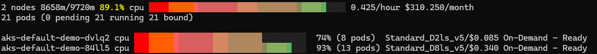
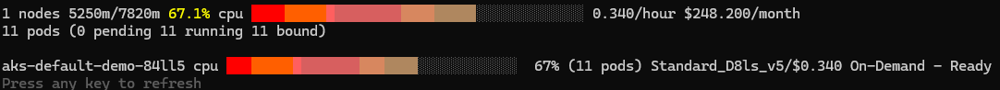
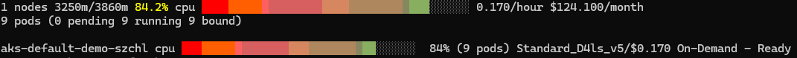
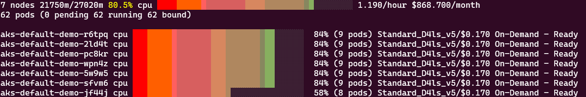
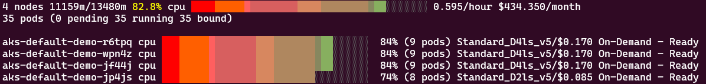
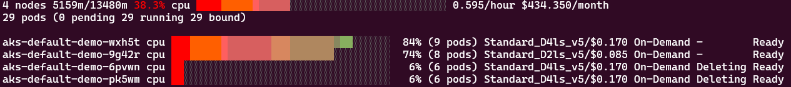
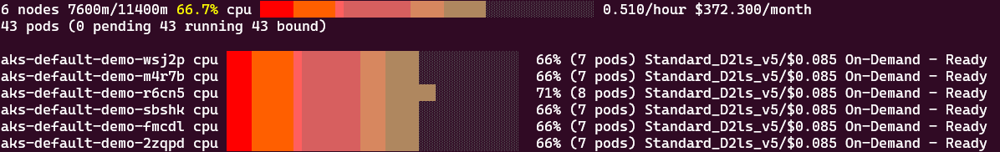
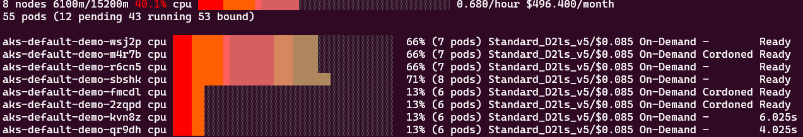
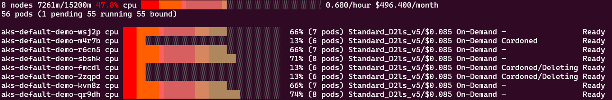

# Cost Optimization and Workload Protection

In this section, we'll focus on two key aspects of Karpenter's disruption capabilities:

1. **Node consolidation** - One of Karpenter's most powerful disruption mechanisms for optimizing cluster resources and reducing costs
2. **Pod-level disruption controls** - How workload owners can protect their applications during consolidation using Pod Disruption Budgets (PDBs) and the `do-not-disrupt` annotation

Through practical examples, we'll see these features in action and learn how they balance cost optimization with application availability.

## 1. Node Consolidation

### Prerequisites

Before beginning, ensure you have:

1. A running AKS cluster with Karpenter enabled
2. The workshop namespace created and the inflate deployment scaled to 0 replicas

### Understanding Consolidation Policies

As we've just seen, Karpenter's consolidation behavior is mainly controlled by the `disruption` section in your NodePool:

```yaml
disruption:
  consolidationPolicy: WhenEmptyOrUnderutilized  
  # Consolidation policy choices
  consolidateAfter: 15s                          
  # Time Karpenter waits after a pod is removed or added to consider consolidation
```

#### What can Karpenter do to optimize resources?

Karpenter can either perform a simple node deletion, or a more complex node replacement: 

  - **Node Deletion**:  Karpenter is allowed to delete a node if all of its pods can run on other nodes within the cluster.
  - **Node Replacement**:  Karpenter is allowed to replace a node if all of its workload pods can run on a combination of of other nodes in the cluster **and** a single cheaper (usually smaller) replacement node.

#### What are the different types of node consolidation?

  - **Empty Node Consolidation**: As seen previously when cleaning up resources in the previous module, Karpenter will delete any empty node in parallel up to its budget allowance (100% that is all at once in our example but otherwise defaults to 10%). 
  - **Single-Node Consolidation**: Karpenter tries to delete any single node, possibly launching a single replacement that is cheaper than the price of that node. For single-node consolidation we consider each node in the cluster individually.
  - **Multi-Node Consolidation**: Karpenter tries to delete two or more nodes in parallel, possibly launching a single replacement that is cheaper than the price of all nodes being removed. 
  
  
When consolidating multiple nodes in parallel, Karpenter priorizes the termination of nodes that disrupt workload the least:

  - nodes hosting fewer workload pods
  - nodes reaching their expiration time
  - nodes hosting pods with lower priority


### Exercise 1: Single-Node Consolidation

Single-node consolidation evaluates each node individually to determine if it should be deleted or replaced with a more cost-effective option.

#### Step 1: Create a NodePool with Single-Node Consolidation

Let's ensure our default NodePool is configured for single-node consolidation:

=== "Bash"
    ```bash
    cat <<EOF | kubectl apply -f -
    --8<-- "assets/yamls/module2/1-nodepool.yaml"
    EOF
    ```
=== "PowerShell"
    ```powershell
    $yamlContent = @"
    --8<-- "assets/yamls/module2/1-nodepool.yaml"
    "@
  
    $yamlContent | kubectl apply -f -
    ```


The key point here is we want to ensure that Karpenter considers replacing underutilized nodes and not only empty ones with the `consolidationPolicy: WhenEmptyOrUnderutilized` disruption configuration.

#### Step 2: Scale out our inflate workload

```bash
kubectl scale deployment -n workshop inflate --replicas 8
```

Based on the resource requirements, Karpenter creates a 8CPU node and 1CPU node. Wait until all the pods are running.

With AKS Node Viewer `aks-node-viewer --resources cpu -node-selector aks-karpenter=demo`



#### Step 3: Trigger Single-Node Consolidation: Deletion

Let's scale down to 5 replicas to create an underutilization situation:

```bash
kubectl scale deployment -n workshop inflate --replicas 5
```

The logical next step for Karpenter would be to terminate the 1CPU node as all the replicas can be hosted on the first node. This is only because we have `EmptyOrUnderutilized` consolidation selected as with `Empty` only, and given that when scaling in the amount of replicas Kubernetes doesn't predictably delete all unnecessary pods from the smaller node but can delete them all from the larger node, thus both nodes would host workloads pods. 

Karpenter recognizes that the second node is able to be drained based on the existing constraints and will disrupt it. Since no additional node is needed to host 5 replicas, the disruption is a Deletion only, in effect a drain and delete of the 2CPU node.

??? note "Self Hosted Karpenter only"
    Monitor the Karpenter logs to see consolidation in action:

    ```bash
    kubectl logs -n karpenter -l app.kubernetes.io/name=karpenter --all-containers --since=3m --tail=-1 -f | grep -v "finished call"
    ```

    You should see Karpenter evaluating nodes for consolidation, with logs similar to:
    ```
    {"level":"INFO","time":"2025-04-30T07:28:05.448Z","logger":"controller","message":"disrupting nodeclaim(s) via delete, terminating 1 nodes (2 pods) aks-default-demo-dvlq2/Standard_D2ls_v5/on-demand","commit":"0f1aca1","controller":"disruption","namespace":"","name":"","reconcileID":"443ee8b0-c1e3-4d47-a5b4-db483b5ee8b8","command-id":"7913743c-542f-44cc-9911-8fae13cf583d","reason":"underutilized"}
    {"level":"INFO","time":"2025-04-30T07:28:06.066Z","logger":"controller","message":"tainted node","commit":"0f1aca1","controller":"node.termination","controllerGroup":"","controllerKind":"Node","Node":{"name":"aks-default-demo-dvlq2"},"namespace":"","name":"aks-default-demo-dvlq2","reconcileID":"004ba6c0-4a56-43ba-b077-ea4864f20c78","taint.Key":"karpenter.sh/disrupted","taint.Value":"","taint.Effect":"NoSchedule"}
    {"level":"INFO","time":"2025-04-30T07:28:57.310Z","logger":"controller","message":"deleted node","commit":"0f1aca1","controller":"node.termination","controllerGroup":"","controllerKind":"Node","Node":{"name":"aks-default-demo-dvlq2"},"namespace":"","name":"aks-default-demo-dvlq2","reconcileID":"a7da84da-47cc-4090-b50e-66ac11a3e11f"}
    {"level":"INFO","time":"2025-04-30T07:28:57.568Z","logger":"controller","message":"deleted nodeclaim","commit":"0f1aca1","controller":"nodeclaim.termination","controllerGroup":"karpenter.sh","controllerKind":"NodeClaim","NodeClaim":{"name":"default-demo-dvlq2"},"namespace":"","name":"default-demo-dvlq2","reconcileID":"f48ddee3-edd6-4a74-9a57-4404c7c816c8","Node":{"name":"aks-default-demo-dvlq2"},"provider-id":"azure:///subscriptions/abc/resourceGroups/mc_karpenter-workshop-rg_karpenter-aks_swedencentral/providers/Microsoft.Compute/virtualMachines/aks-default-demo-dvlq2"}
    ```
    The initial message recognizes an underutilization situation, and disrupts the 2CPU node via Delete, which is carried on right afterwards starting with a `NoSchedule` taint followed by a deletion of the nodeclaim and the node entirely.

After a couple minutes you should see only one node remains:

```bash
kubectl get nodeclaims
kubectl get nodes -l aks-karpenter=demo
```

With AKS Node Viewer `aks-node-viewer --resources cpu -node-selector aks-karpenter=demo`




#### Step 4: Trigger Single-Node Consolidation: Replacement

Now, let's scale down to 3 replicas to create an underutilization situation on our remaining node:

```bash
kubectl scale deployment -n workshop inflate --replicas 3
```

??? note "Self Hosted Karpenter only"
    Monitor the Karpenter logs to see consolidation in action:

    ```bash
    kubectl logs -n karpenter -l app.kubernetes.io/name=karpenter --all-containers --since=3m --tail=-1 -f | grep -v "finished call"
    ```

    You should see Karpenter evaluating nodes for consolidation, with logs similar to:

    ```
    {"level":"INFO","time":"2025-04-30T07:38:30.980Z","logger":"controller","message":"disrupting nodeclaim(s) via replace, terminating 1 nodes (3 pods) aks-default-demo-84ll5/Standard_D8ls_v5/on-demand and replacing with on-demand node from types Standard_D4ls_v5, Standard_D4_v3, Standard_D4_v4, Standard_D4_v5, Standard_D4a_v4 and 14 other(s)","commit":"0f1aca1","controller":"disruption","namespace":"","name":"","reconcileID":"ab2b18b0-63ab-4b8a-b20f-83fd1550b96d","command-id":"e8a20687-8c88-4d8a-9302-d5ab186798d0","reason":"underutilized"}
    {"level":"INFO","time":"2025-04-30T07:38:31.045Z","logger":"controller","message":"created nodeclaim","commit":"0f1aca1","controller":"disruption","namespace":"","name":"","reconcileID":"ab2b18b0-63ab-4b8a-b20f-83fd1550b96d","NodePool":{"name":"default-demo"},"NodeClaim":{"name":"default-demo-szchl"},"requests":{"cpu":"3350m","memory":"570Mi","pods":"9"},"instance-types":"Standard_D12_v2, Standard_D3_v2, Standard_D4_v3, Standard_D4_v4, Standard_D4_v5 and 14 other(s)"}
    {"level":"info","ts":1745998712.111648,"logger":"fallback","caller":"instance/instance.go:650","msg":"Selected instance type Standard_D4ls_v5"}
    {"level":"info","ts":1745998712.1118543,"logger":"fallback","caller":"imagefamily/resolver.go:99","msg":"Resolved image /CommunityGalleries/AKSUbuntu-38d80f77-467a-481f-a8d4-09b6d4220bd2/images/2204gen2containerd/versions/202504.22.0 for instance type Standard_D4ls_v5"}
    ```
    The initial message recognizes an underutilization situation similar to the previous one, but this time the action is a replacement, terminating the 8CPU node and replacing it with a 4CPU node which is appropriate for a total of 3 pods of 1CPU request. This is a message of what Karpenter intends to do overall, it will not directly delete the 8CPU node and leave all pods pending, as you can see in the next messages it first creates a new node, will wait until it is fully ready, then will taint and delete the old node.

You should see a new nodeclaim being created for a 4CPU node, when fully ready the 8CPU one will be marked for deletion, drained and removed:

```bash
kubectl get nodeclaims
kubectl get nodes -l aks-karpenter=demo
```

With AKS Node Viewer `aks-node-viewer --resources cpu -node-selector aks-karpenter=demo`



#### Step 5: Cleanup

```bash
kubectl scale deployment -n workshop inflate --replicas 0
kubectl delete nodepool default-demo
```

### Exercise 2: Multi-Node Consolidation

Multi-node consolidation evaluates your entire cluster and can consolidate multiple underutilized nodes into fewer, more efficiently packed nodes.

#### Step 1: Create a NodePool for Multi-Node Consolidation

Let's update our NodePool specifically for testing multi-node consolidation:

=== "Bash"
    ```bash
    cat <<EOF | kubectl apply -f -
    --8<-- "assets/yamls/module2/2-nodepool-small.yaml"
    EOF
    ```
=== "PowerShell"
    ```powershell
    $yamlContent = @"
    --8<-- "assets/yamls/module2/2-nodepool-small.yaml"
    "@
  
    $yamlContent | kubectl apply -f -
    ```

Note the restrictions on VM size (`karpenter.azure.com/sku-cpu` < 5), which forces Karpenter to create smaller nodes, making multi-node consolidation more predictible and easier to trigger for the purpose of this exercise.

#### Step 2: Scale out our inflate workload

```bash
kubectl scale deployment -n workshop inflate --replicas 20
```

This will create 20 pods, each requiring 1 CPU. With the node size restriction we set, Karpenter will need to provision 7 4CPU nodes, hosting 3 inflate pods each. Examine the nodes as they are created and wait until the nodes are ready and the pods are all running.


```bash
kubectl get nodeclaims
kubectl get nodes -l aks-karpenter=demo
```

With `k9s` you should see all pods running.

Using `aks-node-viewer`, you should see a similar node setup as the below:



#### Step 3: Trigger Multi-Node Consolidation

Now, scale down to create an underutilization situation across multiple nodes:

```bash
kubectl scale deployment -n workshop inflate --replicas 10
```

??? note "Self Hosted Karpenter only"
    Watch the Karpenter logs to observe multi-node consolidation:

    ```bash
    kubectl logs -n karpenter -l app.kubernetes.io/name=karpenter --all-containers --since=3m --tail=-1 -f | grep -v "finished call"
    ```
    You should see logs indicating multi-node consolidation similar to the below:
    ```
    {"level":"INFO","time":"2025-04-30T07:54:01.121Z","logger":"controller","message":"disrupting nodeclaim(s) via replace, terminating 4 nodes (1 pods) aks-default-demo-2ld4t/Standard_D4ls_v5/on-demand, aks-default-demo-sfvm6/Standard_D4ls_v5/on-demand, aks-default-demo-pc8kr/Standard_D4ls_v5/on-demand, aks-default-demo-5w9w5/Standard_D4ls_v5/on-demand and replacing with on-demand node from types Standard_D2ls_v5, Standard_D2as_v5, Standard_D2_v3, Standard_D2_v4, Standard_D2_v5 and 14 other(s)","commit":"0f1aca1","controller":"disruption","namespace":"","name":"","reconcileID":"6e5a9d5d-193a-4263-9e6e-1b20b83363a9","command-id":"bd1b8fef-b460-4bd8-a01a-e619ae618b52","reason":"underutilized"}
    ```
    The log shows that 4 of the initial seven 4CPU nodes can be disrupted together, with a single replacement of one 2CPU node as you can see from the instance types. The total of nodes after this operation will be three 4CPU nodes and one 2CPU node, which will be able to host the 10 replicas of the inflate pod.
    
    As you keep watching the logs, you should see the 2CPU node being initialized and launched, then the three 4CPU nodes identified in the first log will be disrupted and removed.


Karpenter will start consolidating nodes, replacing multiple underutilized nodes with fewer nodes. The optimized result with the least disruption to host these 10 pods is to delete three out of the initial seven 4CPU nodes and replace them with a single 2CPU node. This will be enough resources to host the required 10 replicas of the inflate pod.

You can monitor the nodes being terminated and created:

```bash
kubectl get nodeclaims -w

kubectl get nodes -l aks-karpenter=demo -w
```

Looking at the `aks-node-viewer`, we should now see a similar situation to the below:

```bash
aks-node-viewer --node-selector aks-karpenter=demo --resources cpu
```



#### Step 4: Further Consolidation

To see even more aggressive consolidation, scale down further:

```bash
kubectl scale deployment -n workshop inflate --replicas 4
```

Watch as Karpenter attempts to consolidate down to the minimum number of nodes needed for your workload (one 4CPU + one 2CPU), this time with a simple `delete` consolidation processing the extra 2 nodes simultaneously (due to the 100% budget disruption setup from the nodepool).

```bash
kubectl get nodeclaims -w

kubectl get nodes -l aks-karpenter=demo -w
```
AKS Node Viewer also shows the current action on the nodes (Deletion here).



#### Step 5: Cleanup

Before moving to the next section, scale in your deployment:

```bash
kubectl scale deployment -n workshop inflate --replicas 0
kubectl delete nodepool default-demo
```

## 2. Pod-level disruption controls

As a workload operator it might be scary for your workload's stability to use a cluster where nodes automatically expire and consolidate, which is why Karpenter takes care to support mechanisms so that you are able to control the level of disruption that is manageable by your workload

There are 2 mechanisms that a workload owner can apply to his pods to manage voluntary disruption and minimize impact on his workload:

  - Kubernetes native Pod Disruption Budgets
  - Karpenter specific annotation `do-not-disrupt`

### Pod Disruption Budgets (PDBs)

PDB are Kubernetes native (not Karpenter specific) resources that help maintain application availability during voluntary disruptions by limiting how many pods from a workload can be down simultaneously.

Voluntary disruptions are for instance:

  - Node drains for maintenance or upgrades
  - in the context of Karpenter, consolidation events
    
They offer 2 configuration options:

  - minAvailable: Minimum number of pods that must remain available (absolute number or percentage)
  - maxUnavailable: Maximum number of pods that can be unavailable (absolute number or percentage)

When a voluntary disruption occurs, Kubernetes checks if removing a pod would violate its PDB. If it would, the operation waits until it's safe to proceed. With Karpenter, pods with blocking PDBs will not be evicted or be considered for voluntary disruption actions. When multiple pods on a node have different PDBs, none of the PDBs may be blocking for Karpenter to voluntary disrupt a node

!!! Limitation
    Remember that PDBs only protect against voluntary disruptions, not involuntary ones like hardware failures or pod crashes.

Let's try to use PDBs with the previously created `inflate` deployment:

#### Step 1: Setup

For the purpose of the demonstration let's create a nodepool that can only create 2CPU nodes.

=== "Bash"
    ```bash
    cat <<EOF | kubectl apply -f -
    --8<-- "assets/yamls/module2/4-nodepool-2cpu-pdb.yaml"
    EOF
    ```
=== "PowerShell"
    ```powershell
    $yamlContent = @"
    --8<-- "assets/yamls/module2/2-nodepool-small.yaml"
    "@
  
    $yamlContent | kubectl apply -f -
    ```

Let's now create a Pod Disruption Budget in the workshop namespace specifying that 4 replicas of the inflate pods should be running at minimum:

=== "Bash"
    ```bash
    cat <<EOF | kubectl apply -f -
    --8<-- "assets/yamls/module2/3-pdb.yaml"
    EOF
    ```
=== "PowerShell"
    ```powershell
    $yamlContent = @"
    --8<-- "assets/yamls/module2/3-pdb.yaml"
    "@
  
    $yamlContent | kubectl apply -f -
    ```

Let's scale our inflate deployment to 6 replicas which should each be hosted on a single node:

```bash
kubectl scale deployment -n workshop inflate --replicas 6
```

Wait until the pods are all deployed, you should see a similar setup to the below in AKS Node Viewer:



#### Step 2: Drain 3 nodes at once

Let's trigger the pod disruption budget protection mechanism by draining 3 nodes at once to simulate what Karpenter could do in an hypothetical underutilization situation - this should attempt to disrupt 3 pods.

```bash
kubectl drain --ignore-daemonsets $(k get nodes -l "aks-karpenter" -o name | head -n3) 
```

You should see the eviction protection mechanism as in the logs below:

```
node/aks-default-demo-72lqt cordoned
node/aks-default-demo-cpswt cordoned
node/aks-default-demo-jrcxc cordoned
Warning: ignoring DaemonSet-managed Pods: kube-system/azure-cns-fzd9c, kube-system/azure-ip-masq-agent-chjhm, kube-system/cilium-mmrks, kube-system/cloud-node-manager-bmcxw, kube-system/csi-azuredisk-node-qg57f, kube-system/csi-azurefile-node-ql7qr
evicting pod workshop/inflate-6bf8695d6-8jn6s
pod/inflate-6bf8695d6-8jn6s evicted
node/aks-default-demo-72lqt drained
Warning: ignoring DaemonSet-managed Pods: kube-system/azure-cns-jhqrc, kube-system/azure-ip-masq-agent-pm6rz, kube-system/cilium-6ds7d, kube-system/cloud-node-manager-mdpb4, kube-system/csi-azuredisk-node-wrbbk, kube-system/csi-azurefile-node-4q2tv
evicting pod workshop/inflate-6bf8695d6-7nkn2
pod/inflate-6bf8695d6-7nkn2 evicted
node/aks-default-demo-cpswt drained
Warning: ignoring DaemonSet-managed Pods: kube-system/azure-cns-fbhsb, kube-system/azure-ip-masq-agent-2cxnq, kube-system/cilium-2v7p5, kube-system/cloud-node-manager-vmh9q, kube-system/csi-azuredisk-node-x4fbj, kube-system/csi-azurefile-node-f6sg6
evicting pod workshop/inflate-6bf8695d6-255tl
error when evicting pods/"inflate-6bf8695d6-255tl" -n "workshop" (will retry after 5s): Cannot evict pod as it would violate the pod's disruption budget.
evicting pod workshop/inflate-6bf8695d6-255tl
error when evicting pods/"inflate-6bf8695d6-255tl" -n "workshop" (will retry after 5s): Cannot evict pod as it would violate the pod's disruption budget.
[...]
[...]
evicting pod workshop/inflate-6bf8695d6-255tl
pod/inflate-6bf8695d6-255tl evicted
node/aks-default-demo-jrcxc drained
```

The nodes get cordoned so that no new workload is scheduled there - this doesn't trigger the PDB as the inflate pods are still running. The first two evictions succeeds (4 pods remain available out of 6).

The third eviction is blocked due to the pod disruption budget. Meanwhile Karpenter recreates the missing nodes automatically as due to the drain the first 2 pods are in pending state. You can see the 2 new nodes being created with nodeclaims and AKS Node Viewer as usual.



```bash
kubectl get pods -n workshop -w
kubectl get nodeclaims -w
```

Whenever one the two new nodes become ready and hosts one of the inflate pod, the eviction process is unblocked as you can see in the last three lines of the logs above, and the node is drained. It will trigger another node creation by Karpenter which eventually will host the last pending pod.

Karpenter will also delete the drained node as they are by essence underutilized.



#### Step 3: Clean up

When finished with the exercise, clean up the resources:

```bash
kubectl delete pdb -n workshop inflate-pdb
kubectl scale deployment -n workshop inflate --replicas 0
kubectl delete nodepool default-demo
```

### `do-not-disrupt` Annotation

Karpenter can also be prevented from voluntarily disrupting and draining specific pods by adding the karpenter.sh/do-not-disrupt: "true" annotation to the pod. As a cluster owner, you can treat this annotation as a single-pod, permanently blocking PDB. This has the following consequences:

Like pods with a blocking PDB, pods with the karpenter.sh/do-not-disrupt annotation will not be gracefully evicted. Karpenter will not be able to complete termination of a node until one of the following conditions is met:
  
  - All pods with the karpenter.sh/do-not-disrupt annotation are removed.
  - All pods with the karpenter.sh/do-not-disrupt annotation have entered a terminal phase (Succeeded or Failed).
  - The owning NodeClaim’s terminationGracePeriod has elapsed (more details on this in the additional concepts section).

This is useful for pods that you want to run from start to finish without disruption. Examples of pods that you might want to opt-out of disruption include an interactive game that you don’t want to interrupt or a long batch job (such as you might have with machine learning) that would need to start over if it were interrupted.

```bash
apiVersion: apps/v1
kind: Deployment
spec:
  template:
    metadata:
      annotations:
        karpenter.sh/do-not-disrupt: "true"
```

!!! note "Pod Disruption Budget or do-not-disrupt Annotation for my workload?"
    In general, for most workloads it is best to rely on PDBs except for specific cases where no interruption should be allowed such as the long batch job example just mentioned.


## Summary: 

Karpenter optimizes cluster resources through node consolidation, driven by the `consolidationPolicy` (`WhenEmpty` or `WhenEmptyOrUnderutilized`) and `consolidateAfter` settings in the NodePool.

1.  **Consolidation Triggers & Types**:
    *   **Empty Node**: Nodes with no workload pods are candidates for deletion (if policy allows).
    *   **Underutilized Node**: Nodes whose pods can run elsewhere (potentially on a cheaper replacement node) are candidates for consolidation (if policy is `WhenEmptyOrUnderutilized`). This can trigger:
        *   **Single-Node Consolidation**: Deleting one node or replacing it with a cheaper one.
        *   **Multi-Node Consolidation**: Deleting multiple nodes, potentially replacing them with a single cheaper node. Karpenter prioritizes terminating nodes with fewer pods, nearing expiration, or lower priority pods.

2.  **Execution Process**: When consolidating, Karpenter:
    *   Taints the node(s) with `karpenter.sh/disrupted=NoSchedule`.
    *   Provisions replacement node(s) if needed and waits for them to be ready.
    *   Deletes the original node(s), triggering graceful pod termination and migration to available nodes (including replacements).

3.  **Pod-Level Controls**: Pod Disruption Budgets (PDBs) and the `karpenter.sh/do-not-disrupt` annotation allow workload owners to manage the impact of voluntary disruptions like consolidation.

## Cleanup

Before moving to the next module, be sure clean up your resources:

```bash
kubectl scale deployment -n workshop inflate --replicas 0
```

## Conclusion

Karpenter's disruption mechanisms are powerful features, offering significant cost optimization by continually adjusting your cluster's resources to match actual workload needs, while providing controls to ensure workload stability during these changes.

In this module, you've learned how to:

  - Configure both single-node and multi-node consolidation
  - Test and observe consolidation behavior in action
  - Understand the criteria Karpenter uses when making consolidation decisions
  - Use Pod Disruption Budgets (PDBs) to protect application availability
  - Understand the `do-not-disrupt` annotation for workloads that shouldn't be interrupted

The next section of the current module is optional, it presents additional concepts related to disruption controls and can be skipped if desired.

In the next module, we'll explore multi-architecture workloads and how to use ARM64 in your cluster with the help of Karpenter.

