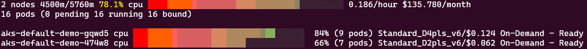
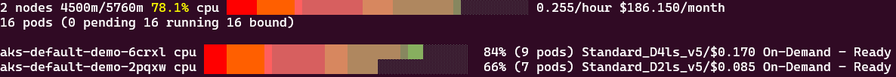

# Multi-Architecture Support with Karpenter

Modern cloud workloads often benefit from different CPU architectures. In this module, we'll explore how Karpenter can manage mixed-architecture environments, specifically focusing on ARM64 support alongside traditional AMD64 (x86_64) nodes.

## Introduction to ARM64 on Azure

ARM64-based VMs on Azure offer several advantages, such as a up-to 50% better price-to-performance ratio for many workloads as well as improved energy efficiency (lower carbon footprint). Because of their ability to scale workloads efficiently, Arm64 VMs are well-suited for web or application servers, open-source databases, cloud-native applications, gaming servers, and other high traffic applications. Furthermore, the switch to ARM64 is straightforward for many workloads, it should thus be encouraged as a simple path towards further cost optimization.

With the support of [multi-architecture images](https://learn.microsoft.com/en-us/azure/container-registry/push-multi-architecture-images) in Azure Container Registry, a single image name, with a version tagged for each architecture, can be used throughout your cluster running both types of nodes. The arm64 version is automatically pulled if the underlying node is arm64-based, and vice versa for amd64 nodes.

Azure offers ARM64-based VMs in several families, including the D-series machines we'll use in this module.

## Prerequisites

Before beginning, ensure you have:

1. A running AKS cluster with Karpenter/NAP enabled
2. The workshop namespace created

## Exercise 1: Configuring ARM64 Support in NodePools

To allow Karpenter to provision ARM64 nodes, we need to update our NodePool configuration to include ARM64 as an allowed architecture.

### Step 1: Create a NodePool with ARM64 Support

=== "Bash"
    ```bash
    cat <<EOF | kubectl apply -f -
    --8<-- "assets/yamls/module3/1-arm64-nodepool.yaml"
    EOF
    ```
=== "PowerShell"
    ```powershell
    $yamlContent = @"
    --8<-- "assets/yamls/module3/1-arm64-nodepool.yaml"
    "@
  
    $yamlContent | kubectl apply -f -
    ```

Key changes to note:

- Changed from B-series to D-series VMs (`karpenter.azure.com/sku-family: D`), as ARM64 is not available in B-series
- Added "arm64" to the allowed architectures (`kubernetes.io/arch`)

For the purpose of this module, we also limit the size of the created VMs to 4CPU maximum and use 4 replicas, this will allow comparisons across different configurations throughout the next exercises.

### Step 2: Deploy a Workload Explicitly Requesting ARM64

Now, let's deploy a workload that specifically requests ARM64 nodes:

=== "Bash"
    ```bash
    cat <<EOF | kubectl apply -f -
    --8<-- "assets/yamls/module3/2-arm64-deploy.yaml"
    EOF
    ```
=== "PowerShell"
    ```powershell
    $yamlContent = @"
    --8<-- "assets/yamls/module3/2-arm64-deploy.yaml"
    "@
  
    $yamlContent | kubectl apply -f -
    ```

The key part of this configuration is the nodeSelector that explicitly requests ARM64 nodes:
```yaml
nodeSelector:
  kubernetes.io/arch: arm64
```

As long as an existing nodepool that allows arm64 nodes is available - so far as it respects the other requirements of the deployment such as the node label - the pods from this deployment will be hosted on arm64 hosts and will remain pending otherwise. Let's verify that in the next step. 

### Step 3: Observe ARM64 Node Provisioning

Verify that new a new NodeClaim is created and that the architecture of the node, once created, is ARM64.

```bash
kubectl get nodeclaims

kubectl get nodes -l aks-karpenter=demo -o custom-columns=NAME:.metadata.name,ARCH:.metadata.labels.kubernetes\\.io/arch
```

??? note "Self Hosted Karpenter only"
    Monitor the Karpenter logs to see consolidation in action:

    ```bash
    kubectl logs -n karpenter -l app.kubernetes.io/name=karpenter --all-containers --since=3m --tail=-1 -f | grep -v "finished call"
    ```

    You should see Karpenter creating ARM64 nodes, with logs similar to:

    ```
    {"level":"INFO","time":"2025-04-30T09:05:58.528Z","logger":"controller","message":"found provisionable pod(s)","commit":"0f1aca1","controller":"provisioner","namespace":"","name":"","reconcileID":"89df6d1a-5b9f-4c9e-b384-10c9397166e2","Pods":"workshop/inflate-644fc55c75-zcd2f, workshop/inflate-644fc55c75-kvhm2, workshop/inflate-644fc55c75-xmz4d, workshop/inflate-644fc55c75-rx55v","duration":"17.375028ms"}
    {"level":"INFO","time":"2025-04-30T09:05:58.528Z","logger":"controller","message":"computed new nodeclaim(s) to fit pod(s)","commit":"0f1aca1","controller":"provisioner","namespace":"","name":"","reconcileID":"89df6d1a-5b9f-4c9e-b384-10c9397166e2","nodeclaims":2,"pods":4}
    {"level":"INFO","time":"2025-04-30T09:05:58.543Z","logger":"controller","message":"created nodeclaim","commit":"0f1aca1","controller":"provisioner","namespace":"","name":"","reconcileID":"89df6d1a-5b9f-4c9e-b384-10c9397166e2","NodePool":{"name":"default-demo"},"NodeClaim":{"name":"default-demo-474w8"},"requests":{"cpu":"1350m","memory":"570Mi","pods":"7"},"instance-types":"Standard_D2pds_v5, Standard_D2pds_v6, Standard_D2plds_v5, Standard_D2plds_v6, Standard_D2pls_v5 and 11 other(s)"}
    {"level":"INFO","time":"2025-04-30T09:05:58.546Z","logger":"controller","message":"created nodeclaim","commit":"0f1aca1","controller":"provisioner","namespace":"","name":"","reconcileID":"89df6d1a-5b9f-4c9e-b384-10c9397166e2","NodePool":{"name":"default-demo"},"NodeClaim":{"name":"default-demo-gqwd5"},"requests":{"cpu":"3350m","memory":"570Mi","pods":"9"},"instance-types":"Standard_D4pds_v5, Standard_D4pds_v6, Standard_D4plds_v5, Standard_D4plds_v6, Standard_D4pls_v5 and 3 other(s)"}
    {"level":"info","ts":1746003958.5657442,"logger":"fallback","caller":"instance/instance.go:650","msg":"Selected instance type Standard_D4pls_v6"}
    {"level":"info","ts":1746003959.6019342,"logger":"fallback","caller":"instance/instance.go:650","msg":"Selected instance type Standard_D2pls_v6"}
    ```
    The beginning is similar to what you have already seen, Karpenter identified provisionable pods in need of a node, but this time it creates ARM64 nodes (note the `p` in the instance type).

Using `aks-node-viewer`, you can see the price of your deployment.

```bash
aks-node-viewer --node-selector aks-karpenter=demo --resources cpu
```

Below is an example of the output the time of this workshop, in a sample subscription.



For comparison's sake, after updating the deployment to run on AMD64 nodes (Karpenter then recognizes the Drift and automatically creates AMD64 nodes), this is what `aks-node-viewer` shows:



As you can see there is a clear price difference between hosting workloads on ARM64 vs AMD64, in this specific example ~27% reduction.

## Best Practices for Multi-Architecture Deployments

To summarize:

1. **Use multi-architecture container images**: Ensure your container images support both amd64 and arm64 architectures.

2. **Test workloads on both architectures**: Some workloads may perform differently on ARM vs x86.

3. **Consider using NodePools with mixed architecture support**: This gives Karpenter flexibility to choose the most appropriate architecture.

4. **Use explicit nodeSelectors for architecture-specific workloads**: When needed, explicitly request a specific architecture.

5. **Monitor performance and cost metrics**: Track the performance and cost differences between architectures.

## Use Cases for ARM64 Nodes

ARM64 nodes are particularly well-suited for:

1. **Web services and APIs**: Often more cost-effective for serving HTTP traffic

2. **Containerized microservices**: Good performance for general containerized workloads

3. **CI/CD pipelines**: Can reduce costs for build and test workloads that run frequently

4. **Cost-sensitive batch processing**: For non-time-critical batch processing

5. **Machine learning inference**: Some ML inference workloads are optimized for ARM

## Cleanup

Before moving to the next module, clean up your resources:

```bash
kubectl delete deployment -n workshop inflate
kubectl delete nodepool default-demo
```

## Conclusion

In this module, you've learned how to leverage ARM64 architecture alongside traditional AMD64 nodes using Karpenter. Key takeaways include:

- How to configure NodePools to support ARM64 nodes
- Deploying workloads that specifically target ARM64 architecture
- Best practices for managing multi-architecture deployments

By intelligently selecting the right architecture for each workload, you can achieve a better balance of performance and cost efficiency.

In the next module, we'll explore how to use Karpenter's spot instance capabilities to further optimize costs.