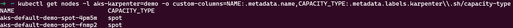
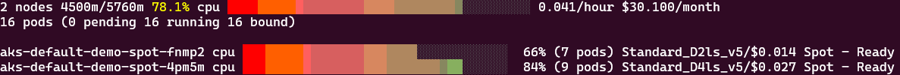
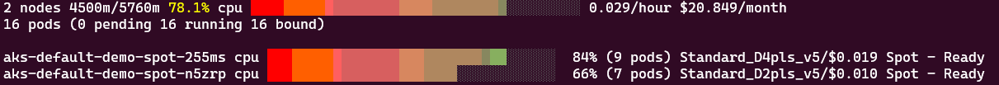

# Cost Optimization with Spot Instances in Karpenter

Azure spot instances are unused Azure capacity that can be allocated at a significant discount compared to on-demand pricing. The trade-off is that Azure may reclaim these instances with a 30s notice when it needs the capacity back.

Key characteristics of spot instances:

- Much lower cost (up to 90% discount)
- May be evicted with 30 seconds notice
- Availability varies by region and VM size
- Perfect for fault-tolerant, batch, or stateless workloads

In this module, we'll explore how to leverage Karpenter to use Spot efficiently.

## Prerequisites

Before beginning, ensure you have:

1. A running AKS cluster with Karpenter/NAP enabled
2. The workshop namespace created

## Exercise 1: Basic Spot Instance Configuration

Let's start by creating a new NodePool that can only deploy spot instances.

### Step 1: Create a Spot-Based NodePool

=== "Bash"
    ```bash
    cat <<EOF | kubectl apply -f -
    --8<-- "assets/yamls/module4/1-spot-only-nodepool.yaml"
    EOF
    ```
=== "PowerShell"
    ```powershell
    $yamlContent = @"
    --8<-- "assets/yamls/module4/1-spot-only-nodepool.yaml"
    "@
  
    $yamlContent | kubectl apply -f -
    ```

The key configuration is setting `karpenter.sh/capacity-type` to `spot`, which tells Karpenter to provision spot instances. For the purpose of this module, we still limit the size of the created VMs to 4CPU maximum, this will allow comparisons across different configurations in the next exercises.

### Step 2: Deploy a Spot-Compatible Workload

Next, let's update our deployment so it runs exclusively on spot instances, for now using amd64:

=== "Bash"
    ```bash
    cat <<EOF | kubectl apply -f -
    --8<-- "assets/yamls/module4/2-spot-only-amd64-deploy.yaml"
    EOF
    ```
=== "PowerShell"
    ```powershell
    $yamlContent = @"
    --8<-- "assets/yamls/module4/2-spot-only-amd64-deploy.yaml"
    "@
  
    $yamlContent | kubectl apply -f -
    ```

### Step 3: Observe Spot Instance Provisioning

Examine the nodes to verify they're using spot capacity:

```bash
kubectl get nodes -l aks-karpenter=demo -o custom-columns=NAME:.metadata.name,CAPACITY_TYPE:.metadata.labels.karpenter\\.sh/capacity-type
```




You can also view nodes using the AKS Node Viewer tool:

```bash
aks-node-viewer --node-selector aks-karpenter=demo
```



If we compare to the AMD64 cost of the same workload from the previous exercise ($186.15/month), this represents a ~84% saving - keeping in mind you will not see the exact same values in your version as spot prices depend on region and availability.


## Exercise 2: Combining Spot with ARM64 for Maximum Cost Savings

ARM64 instances are already cheaper than equivalent AMD64 VMs. By combining ARM64 architecture with spot pricing, we can achieve even greater cost savings. The nodepool we created in Exercise 1 already allows for both AMD64 and ARM64 architectures, so we can simply update our deployment to request ARM64 nodes.

### Step 1: Deploy a Workload for ARM64 Spot Instances

Let's update our workload to specifically request ARM64 spot instances with a combination of `nodeSelector` configurations:

=== "Bash"
    ```bash
    cat <<EOF | kubectl apply -f -
    --8<-- "assets/yamls/module4/3-spot-only-arm64-deploy.yaml"
    EOF
    ```
=== "PowerShell"
    ```powershell
    $yamlContent = @"
    --8<-- "assets/yamls/module4/3-spot-only-arm64-deploy.yaml"
    "@
  
    $yamlContent | kubectl apply -f -
    ```


### Step 2: Observe and Compare Cost Savings

Let's verify our ARM64 spot instances are provisioned correctly:

```bash
kubectl get nodes -l aks-karpenter=demo -o custom-columns=NAME:.metadata.name,ARCH:.metadata.labels.kubernetes\\.io/arch,CAPACITY_TYPE:.metadata.labels.karpenter\\.sh/capacity-type
```

You should see nodes with ARM64 architecture and spot capacity type.

Now let's use the AKS Node Viewer to compare the cost of our AMD64 and ARM64 spot instances:

```bash
aks-node-viewer --node-selector "aks-karpenter=spot" --resources cpu
```



This time we observe in our conditions a ~85% cost reduction from on-demand and the lowest cost profile overall.

Currently we have the following cost values for our 4 pods on 2 nodes - keep in mind that the exact amount will vary for you based on region, VM size, and current spot market conditions:

| Instance Type | AMD64 | ARM64 |
|---------------|-------|-------|
| On-demand     | $186.15  | $135.78   |
| Spot          | $30.1   | $20.85   |

As you can see from this sample pricing table based on the AKS node viewers outputs so far, combining ARM64 with spot instances gives you the maximum cost savings - over 80% less than standard on-demand AMD64 VMs. 

In module 6 we will explore additional concepts and discuss how to deploy workloads across spot and on demand configurations for additional safety.

## Best Practices for Spot Instances with Karpenter

1. **Design for resilience**: Build applications that can handle sudden terminations.
2. **Deploy adequate replicas**: Ensure you have enough replicas to maintain service when nodes are evicted.
3. **Implement health checks and readiness probes**: Ensure traffic only routes to healthy pods.
4. **Distribute pods across nodes**: Use pod anti-affinity to reduce impact of single-node evictions.
5. **Use Horizontal Pod Autoscaler**: Automatically maintain minimum required replicas.
6. **Avoid using spot for stateful workloads**: Unless you have a robust replication strategy.
7. **Monitor spot evictions**: Track metrics to understand impact and optimize strategies.
8. **Use a mix of instance types**: In the exercises above we used explicitely the D family with small nodes only, aim to allow more instance families and sizes to spot availability and find the lowest price.
9. **Implement proper lifecycle hooks**: Use preStop hooks to gracefully terminate connections when the eviction signal is received.

## Cleanup

Before moving to the next module, clean up your resources:

```bash
kubectl delete deployment -n workshop inflate
kubectl delete nodepool default-demo-spot
```

## Conclusion

In this module, you've learned how to leverage spot instances with Karpenter for significant cost savings. Key takeaways include:

- How to configure NodePools and deployments to use spot instances 
- How to combine ARM64 architecture with spot pricing for maximum cost savings
- Practical comparison of cost differences between on-demand and spot instances across architectures

By effectively using spot instances with Karpenter, you can dramatically reduce your AKS compute costs while maintaining application availability and performance. The combination of spot instances with Karpenter's intelligent provisioning across different architectures makes for a particularly powerful cost optimization strategy.

In the next module, we'll explore team isolation and working with multiple nodepools to provide separation and organization of workloads across different teams.