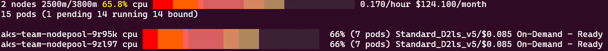

# Team Isolation with Multiple NodePools

In enterprise environments, it's common to have multiple teams sharing a single Kubernetes cluster, or maybe even just a single team hosting very different workloads with their own requirements in the same cluster. In this module, we'll explore how to use Karpenter's NodePools to create isolated configurations for different requirements while maintaining efficient resource utilization.

## Use Cases for Multiple NodePools

Multiple NodePools provide flexibility in your cluster configuration. Some common use cases include:

- **Separate capacity for different teams**: Configure teams on the same cluster to run on completely separate node capacity.
- **Diverse operating systems**: One team could run on nodes using AzureLinux, while another uses Ubuntu.
- **Billing isolation**: Use separate NodePools to track infrastructure costs by team or department.
- **Different node constraints**: Restrict certain teams from using specialized hardware (such as GPUs) or limit them to specific VM types.
- **Custom deprovisioning settings**: Apply different scaling behaviors based on workload patterns.

!!! Note
    It is recommended to create nodepools that are mutually exclusive. Pods should not match multiple nodepools. If multiple nodepools are matched, Karpenter will use the node pool with the highest weight (e.g., `weight: 10` in the nodepool spec).

!!! Note
    In the approach discussed in this module, isolation is done at the node level, each team having its own nodes. Depending on your own requirements, it is also entirely possible that you do not need that level of isolation and all your workloads can run on the same nodes. In this case, a single nodepool might even be sufficient and you can refer to what we have seen in earlier modules directly. 
    
    You might still need some additional nodepools for specific workloads even run by a given team so it is still useful to understand the interactions of multiple NodePool in a Karpenter-enabled cluster.

## Prerequisites

Before beginning, ensure you have:

1. A running AKS cluster with Karpenter/NAP enabled
2. The workshop namespace created

## Exercise 1: Enforce team identification

Let's start with a simple usecase to ensure that each deployment declares a team keyword in their resources `nodeSelector`, and nodes hosting team-specific workload should repel non-team workload.

### Step 1: Create a team nodepool

=== "Bash"
    ```bash
    cat <<EOF | kubectl apply -f -
    --8<-- "assets/yamls/module5/1-team-nodepool.yaml"
    EOF
    ```
=== "PowerShell"
    ```powershell
    $yamlContent = @"
    --8<-- "assets/yamls/module5/1-team-nodepool.yaml"
    "@
  
    $yamlContent | kubectl apply -f -
    ```

The key configurations in the team nodepool are:

1. The `microsoft.com/team` to `Exists` addition to the requirements array, which tells Karpenter that this Nodepool will only deploy nodes for workloads which present a `microsoft.com/team` key with any value in their `nodeSelector`. The value specified will be added to the newly created nodes.

2. The nodepool also applies taints to the nodes with the `microsoft.com/team` key, which ensures that only pods with matching tolerations can be scheduled on these nodes. This provides two-way protection - the nodeSelector ensures team pods go to the right nodes, while taints ensure non-team pods stay away from those nodes.

Together, these configurations ensure that pods coming later and presenting a different value for their team will not be scheduled on the existing nodes, and nodes created for specific teams will only accept workloads from those teams.


### Step 2: Deploy Team-Specific Workloads

Now, let's verify this by deploying workloads for each team that will run on their dedicated nodes, as well as a workload that tries to deploy with the same team-demo nodeSelector but without a toleration:

=== "Bash"
    ```bash
    cat <<EOF | kubectl apply -f -
    --8<-- "assets/yamls/module5/4-team-data-deploy.yaml"
    ---
    --8<-- "assets/yamls/module5/5-team-research-deploy.yaml"
    ---
    --8<-- "assets/yamls/module5/8-noteam-deploy.yaml"
    EOF
    ```
=== "PowerShell"
    ```powershell
    $yamlContent = @"
    --8<-- "assets/yamls/module5/4-team-data-deploy.yaml"
    ---
    --8<-- "assets/yamls/module5/5-team-research-deploy.yaml"
    ---
    --8<-- "assets/yamls/module5/8-noteam-deploy.yaml"
    "@
  
    $yamlContent | kubectl apply -f -
    ```

The team workload deployments (data and research) contain two crucial elements for proper isolation:

1. nodeSelector with team label: This directs pods to nodes with a matching team label (similarly to what we have done in all modules so far with `aks-karpenter: demo` selector but this time this is enforced )
   ```yaml
   nodeSelector:
     microsoft.com/team: data  # or 'research' for the other team
   ```

2. Matching toleration: This allows pods to run on nodes tainted for their specific team
   ```yaml
   tolerations:
   - key: "microsoft.com/team"
     operator: "Exists"
     effect: "NoSchedule"
   ```

The no-team deployment should fail to schedule because:

- It has a nodeSelector targeting team nodes (`aks-karpenter: demo-team`)
- But it lacks the required toleration to overcome the team-specific taint

This demonstrates how the combination of nodeSelectors and taints/tolerations creates a complete isolation system:

- nodeSelectors ensure pods land on the right nodes
- Taints prevent pods without proper tolerations from scheduling on team-specific nodes

### Step 3: Verify Team Isolation

Check that each workload is running on their team's dedicated nodes. You should see each of these pods on a specific node:

```bash
kubectl get pods -n workshop -l team=data -o wide 
kubectl get pods -n workshop -l team=research -o wide
```

Looking at all pods you deployed which all use the `app:inflate-team` label, you should see the one that did not include team information remains indefinitely in pending state:

```bash
kubectl get pods -n workshop -l app=inflate-team
```

You can also see the team-specific taints, team and instance type of each node:

```bash
kubectl get nodes -l aks-karpenter=demo-team -o custom-columns=NAME:.metadata.name,TAINTS:.spec.taints,TEAM:.metadata.labels."microsoft\.com/team",INSTANCE_TYPE:.metadata.labels."node\.kubernetes\.io/instance-type"
```
As we only have one nodepool, and given the deployments do not ask for different types of nodes between data and research workload, both nodes should be the same instance type.

Using AKS Node Viewer this time with a different node selector as the nodepool in this exercise uses a different label `aks-karpenter=demo-team`, you should however see nodes with the same naming pattern as they come from the same nodepool.
```
aks-node-viewer -node-selector aks-karpenter=demo-team
```



### Step 4: Cleanup

```bash
kubectl delete deployment -n workshop inflate-team-data inflate-team-research inflate-noteam  
kubectl delete nodepool team-nodepool
```


## Exercise 2: Implement Team-Specific Provisioning Strategies

Different teams often have different infrastructure needs and cost sensitivities and might be required to use specific types of nodes. Let's implement team-specific provisioning strategies and this time ensure that each team has its own NodePool.

### Step 1: Create a NodePool for each Team

=== "Bash"
    ```bash
    cat <<EOF | kubectl apply -f -
    --8<-- "assets/yamls/module5/2-team-data-nodepool.yaml"
    ---
    --8<-- "assets/yamls/module5/3-team-research-nodepool.yaml"
    EOF
    ```
=== "PowerShell"
    ```powershell
    $yamlContent = @"
    --8<-- "assets/yamls/module5/2-team-data-nodepool.yaml"
    ---
    --8<-- "assets/yamls/module5/3-team-research-nodepool.yaml"
    "@
  
    $yamlContent | kubectl apply -f -
    ```

Note the key changes here relevant to team scheduling:

  - The requirement section requiring` microsoft.com/key` now explicitely mentions it requires a team-relevant value (team-data or team-research depending on the nodepool)
  - The attached taint now also requires a specific team-relevant value

Besides those, from a workload perspective the team-data nodepool provisions arm64/spot instances whereas the team-research nodepool provisions amd64/on-demand instances. A usecase for this could be the data team running java-based stateless microservices which can be easily stopped and started while the research team hosting long running batch jobs that should not be interrupted.

!!! Note
    In a production context, the research team would be both using on-demand nodes (to avoid involuntary evictions due to spot reclaims) and the `do-not-disrupt` annotation that was demonstrated in module 2 for this kind of workload.

### Step 2: Deploy Team-Specific Workloads

Let's deploy workloads to verify it works as expected.

=== "Bash"
    ```bash
    cat <<EOF | kubectl apply -f -
    --8<-- "assets/yamls/module5/6-team-data-deploy-tainted.yaml"
    ---
    --8<-- "assets/yamls/module5/7-team-research-deploy-tainted.yaml"
    EOF
    ```
=== "PowerShell"
    ```powershell
    $yamlContent = @"
    --8<-- "assets/yamls/module5/6-team-data-deploy-tainted.yaml"
    ---
    --8<-- "assets/yamls/module5/7-team-research-deploy-tainted.yaml"
    "@
  
    $yamlContent | kubectl apply -f -
    ```

### Step 3: Verify each team is now running on different types of nodes.

Let's wait until nodes are correctly created:

```bash
kubectl get nodeclaims -w
```

Now let's verify the pods are running on different types of nodes based on their team assignment. This command will show each pod, the node it's running on, and details about that node's instance type and architecture:

```bash
kubectl get pods -n workshop -l app=inflate-team -o custom-columns=POD:.metadata.name,NODE:.spec.nodeName,TEAM:.metadata.labels.team,STATUS:.status.phase | sort -k3
echo ""
echo "Node details:"
kubectl get nodes -l aks-karpenter=demo-team -o custom-columns=NAME:.metadata.name,INSTANCE_TYPE:.metadata.labels."node\.kubernetes\.io/instance-type",ARCH:.metadata.labels."kubernetes\.io/arch",CAPACITY_TYPE:.metadata.labels."karpenter\.sh/capacity-type"
```

You should see that:

- Data team pod is running on arm64 spot instances
- Research team pod is running on amd64 on-demand instances

You can also verify with AKS Node Viewer:

```bash
aks-node-viewer --node-selector "aks-karpenter=demo-team"
```


### Step 4: Cleanup

```bash
kubectl delete deployment -n workshop inflate-team-data inflate-team-research
kubectl delete nodepool team-data-nodepool team-research-nodepool 
```

## Best Practices for Team Management with Karpenter

1. **Use bidirectional protection with nodeSelectors and taints**: Implement both mechanisms to ensure pods go to appropriate nodes and nodes reject inappropriate pods.

2. **Define team-specific provisioning strategies**: Customize infrastructure based on each team's unique requirements.

3. **Use explicit team labeling**: Standardize identification of team resources for clarity and management.

4. **Create mutually exclusive NodePools**: Avoid conflicts when Karpenter selects which NodePool to use.

5. **Set appropriate resource limits per team**: Control costs and capacity allocation on a team-by-team basis.

8. **Monitor team resource utilization**: Track usage patterns to optimize costs and performance.

## Conclusion

In this module, you've learned how to use Karpenter NodePools to create isolated environments for different teams while maintaining efficient resource utilization. Key takeaways include:

- Creating team-specific NodePools with nodeSelectors and taints for bidirectional isolation
- Configuring different infrastructure strategies for different teams' requirements

Karpenter allows you to provide customized infrastructure experiences for multiple colocated groups while still benefiting from efficiency and automation. This approach enables cost optimization, security isolation, and tailored infrastructure on a per-team basis.