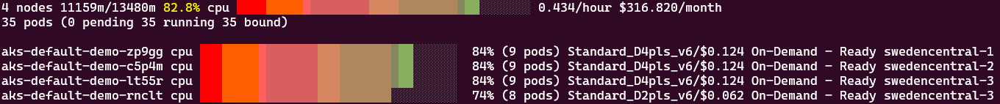
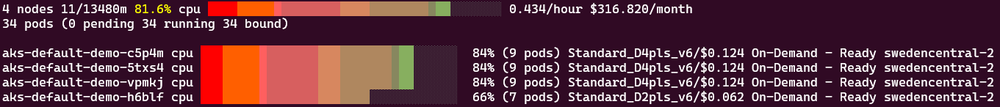
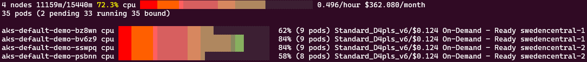
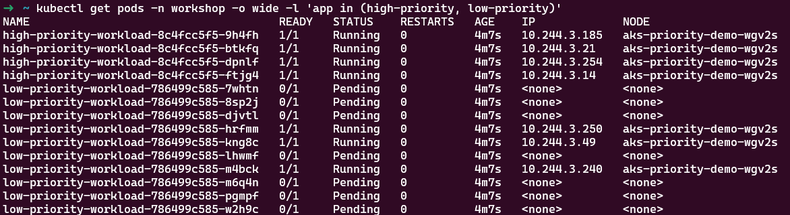
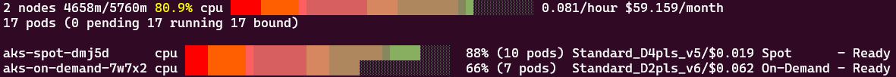

# Advanced Scheduling with Karpenter

While Karpenter's primary job is to automatically provision and manage nodes, it also integrates deeply with Kubernetes scheduling concepts to provide more sophisticated workload placement. This includes:

1. **Topology-aware scheduling**: Ensuring workloads are placed across different failure domains or zones
2. **Pod topology spread constraints**: Distributing workloads evenly across your cluster
3. **Taints and tolerations**: Dedicating nodes for specific workload types - as we have seen in the previous module

## How Kubernetes Scheduling Constraints Work with Karpenter

As we've seen throughout this workshop, Kubernetes has well-established scheduling attributes and constraints that Karpenter leverages and extends.

1. **Cloud Provider Constraints (First Layer)**: The foundational layer includes all instance types, architectures, zones, and purchase types available from Azure.
2. **NodePool Constraints (Second Layer)**: Cluster administrators define constraints by creating NodePools that limit which types of nodes Karpenter can create.
3. **Pod Scheduling Constraints (Final Layer)**: Individual workload specifications add the final constraints, which must fall within the NodePool's constraints to be scheduled.

Without specific requirements in your pods, Karpenter can choose from the full range of available cloud provider resources within your NodePool constraints. As you add scheduling requirements to your pods, you're effectively narrowing down this selection. 

In this module we'll focus on scheduling constraints that help you place your workload optimally using Kubernetes-native constructs understood by Karpente, focusing first on zone-aware scheduling which is a key configuration to improve workload resilience.

## Prerequisites

Before beginning, ensure you have:

1. A running AKS cluster with Karpenter/NAP enabled
2. The workshop namespace created

## Exercise 1: Zone-Aware Node Provisioning

In this exercise and the following one we will implement workload that spreads across zones, and by opposition how we can simply restrict workload to a single zone.

### Step 1: Deploy a NodePool allowing all zones

Let's deploy a new nodepool for the exercise.

!!! note "Known Limitation"
    Today's Karpenter on Azure does not support "topology.kubernetes.io/zone" at the NodePool level due to AKS limitations, by default a NodePool authorizes deployment of resources on all zones. There is a deprecated configuration `failure-domain.beta.kubernetes.io/zone` that can be set in the NodePool requirements but this currently creates instabilities in the nodes deployment with a constant disruption. Topology spread constraints can still be implemented at the workload layer, but a cluster administrator cannot restrict specifically the use of zones without creating stability side-effects.

=== "Bash"
    ```bash
    cat <<EOF | kubectl apply -f -
    --8<-- "assets/yamls/module6/1-nodepool.yaml"
    EOF
    ```
=== "PowerShell"
    ```powershell
    $yamlContent = @"
    --8<-- "assets/yamls/module6/1-nodepool.yaml"
    "@
  
    $yamlContent | kubectl apply -f -
    ```

Based on the limitation above, it is currently not possible to restrict the zones efficiently in the node pool, and since by default all zones are allowed, this is essentially a nodepool similar to what you have deployed in the first module.

<!-- !!! note "NodePools and Zones"
    Adding all zones to the NodePool is done for the purpose of this demo only, generally there is no point in specifying all zones in a NodePool as all zones are allowed by default. It is more useful to restrict nodes to a single zone, for instance to enforce all workloads of a given team to use a specific AZ. In practice, it is often best to decide this at the workload layer rather than enforce it on the NodePool as the workload owner should know what is best for what he deploys. -->

### Step 2: Deploy a workload across allowed zones

Now, let's deploy a workload that uses pod topology spread constraints to distribute across zones:

=== "Bash"
    ```bash
    cat <<EOF | kubectl apply -f -
    --8<-- "assets/yamls/module6/2-scheduling-topology-deploy.yaml"
    EOF
    ```
=== "PowerShell"
    ```powershell
    $yamlContent = @"
    --8<-- "assets/yamls/module6/2-scheduling-topology-deploy.yaml"
    "@
  
    $yamlContent | kubectl apply -f -
    ```

Key features of this configuration:

- `topologySpreadConstraints` with `topologyKey: topology.kubernetes.io/zone` evenly distributes pods across zones
- `maxSkew: 1` ensures no zone has more than 1 extra pod compared to others
- `whenUnsatisfiable: DoNotSchedule` blocks pods from being scheduled if balance is impossible

The workload deploys 10 replicas, which should ideally place 3 pods in each of the 3 zones plus one pod in one of the zones. This means at least one node per zone.

Let's wait until nodes are correctly created:

```bash
kubectl get nodeclaims -w
```

??? note "Only one node is deploying?"
    If you encounter an issue, that might be because your subscription is not allowed to deploy ARM64 nodes in the region you are running the workshop. Verify the list of VMs SKUs and Zones available to your subscription using the az cli `az vm list-skus --location YOUR_REGION --resource-type virtualMachines --output table`. Try to update the NodePool to deploy a family type that is allowed on all Zones in your subscription.


### Step 3: Verify Pods are Running

Check the pods are all running:

```bash
kubectl get pods -n workshop -l app=inflate
```

Check at least one 4CPU node has been created in each zone and one additional 2CPU instance in any of the 3 zones:

```bash
kubectl get nodes -l aks-karpenter=demo -o custom-columns=NAME:.metadata.name,INSTANCE-TYPE:.metadata.labels.node\\.kubernetes\\.io/instance-type,ZONE:.metadata.labels.topology\\.kubernetes\\.io/zone
```

You can also visualize with AKS Node Viewer with an extra parameter for availability zones:
```
aks-node-viewer -node-selector aks-karpenter=demo --extra-labels topology.kubernetes.io/zone  
```




### Step 4: Force Provisioning in a Specific Zone

Sometimes you need workloads to run in a specific zone, such as for data locality, this can be done with a nodeSelector as in the example below or with node affinity as we will see in the next exercise.

Before applying, replace the zone value by one of the zones region in which you run your cluster e.g. `"swedencentral-2"` by `"westus2-2"`.


=== "Bash"
    ```bash
    cat <<EOF | kubectl apply -f -
    --8<-- "assets/yamls/module6/3-scheduling-one-zone-deploy.yaml"
    EOF
    ```
=== "PowerShell"
    ```powershell
    $yamlContent = @"
    --8<-- "assets/yamls/module6/3-scheduling-one-zone-deploy.yaml"
    "@
  
    $yamlContent | kubectl apply -f -
    ```

This deployment uses a `nodeSelector` with `topology.kubernetes.io/zone: "westus2-2"` to force all pods to run in zone 1.

After provisioning you should see 4 nodeclaims remaining: 3 3CPU and 1 1CPU nodes, all in zone 2.




### Step 5: Cleanup

```bash
kubectl delete deployment inflate -n workshop
```

## Exercise 2: Using Node Affinities with Karpenter

Node affinities provide more flexible control over pod placement than simple node selectors. 

They come in two types:

  - **requiredDuringSchedulingIgnoredDuringExecution**: Hard requirements that must be met (similar to nodeSelector but more expressive)
  - **preferredDuringSchedulingIgnoredDuringExecution**: Soft preferences that the scheduler will try to satisfy, but won't guarantee

Each of these types contains an expression to match on keys such as architecture, topology, etc., with an operator such `In`, `Exists`, `Gt` and optionally a weight parameter that allows priorization of preferred conditions. The [Kubernetes documentation](https://kubernetes.io/docs/concepts/scheduling-eviction/assign-pod-node/#node-affinity) goes into details into the feature.

Karpenter aims to respect these requirements to create nodes fitting the workload requirements, as long as they can fit within the existing NodePool definitions.

### Step 1: Create a deployment balanced on two zones

In this exercise, we'll assume your nodepool gives you access to three availability zones but your workload only needs to be spread across two zones to fit your requirements. A combination of the TopologySpreadConstraint seen in exercise 1 together with NodeAffinity will be able to solve this requirement, in fact the nodeAffinity restricts pods to nodes in zones 1 and 2, so the topologySpreadConstraints will only consider those nodes when balancing the pods.

The goal is this time, for 10 replicas, to have them run on 4 nodes total, for each zone 2 4CPU Nodes, which will respectively host 3 and 2 workload pods. The max skew should be 1 for our workload. The below example implements this requirement. Before applying it, update the zone values in the affinity rule for your region and verify you do not have any nodes deployed.

=== "Bash"
    ```bash
    cat <<EOF | kubectl apply -f -
    --8<-- "assets/yamls/module6/4-scheduling-topology-affinity-deploy.yaml"
    EOF
    ```
=== "PowerShell"
    ```powershell
    $yamlContent = @"
    --8<-- "assets/yamls/module6/4-scheduling-topology-affinity-deploy.yaml"
    "@
  
    $yamlContent | kubectl apply -f -
    ```

### Step 2: Observe Node Affinity Preferences

Check the deployment of your nodes via nodeclaims:

```bash
kubectl get nodeclaims -w
```

You should see the nodes deployed on zone 1 and 2 as expected. Note that if you had remaining workload from the previous exercise your results might vary as Karpenter tries to avoid disruption whenever possible (e.g. one zone might have a single 4CPU + two 2CPU nodes which can also host the same workload).

Check that your pods are correctly scheduled and none remain pending:

```bash
kubectl get pods -n workshop -l app=inflate
```

Using AKS Node Viewer:


### Step 3: Cleanup

```bash
kubectl delete deployment inflate -n workshop
kubectl delete nodepool default-demo
```


## Exercise 3: Pod Priority and Preemption

Pod priority helps Kubernetes decide which pods to schedule first and which to evict when resources are scarce. This feature is helpful for ensuring critical workloads get resources even during cluster pressure (which can still happen with Karpenter if the existing NodePools reach their configured limits).

Pod priority works through two main mechanisms:

- **Priority Classes**: Define the relative importance of pods with numerical values
- **Preemption**: The process where lower priority pods are evicted to make room for higher priority pods

When the scheduler encounters a pod that cannot be scheduled due to insufficient resources, it will look for lower priority pods that could be evicted to make room for the higher priority pod. This is particularly useful in clusters with high resource utilization.

### Step 1: Create Priority Classes

First, let's create some priority classes:

=== "Bash"
    ```bash
    cat <<EOF | kubectl apply -f -
    --8<-- "assets/yamls/module6/5-priorityclasses.yaml"
    EOF
    ```
=== "PowerShell"
    ```powershell
    $yamlContent = @"
    --8<-- "assets/yamls/module6/5-priorityclasses.yaml"
    "@
  
    $yamlContent | kubectl apply -f -
    ```

### Step 2: Create Constrained Resources and Observe Scheduling Priorization

Let's create a NodePool with tight resource limits to 8CPU to force priorization decisions:

=== "Bash"
    ```bash
    cat <<EOF | kubectl apply -f -
    --8<-- "assets/yamls/module6/6-priority-nodepool.yaml"
    EOF
    ```
=== "PowerShell"
    ```powershell
    $yamlContent = @"
    --8<-- "assets/yamls/module6/6-priority-nodepool.yaml"
    "@
  
    $yamlContent | kubectl apply -f -
    ```

Now deploy our priority-based workloads to the constrained pool:

=== "Bash"
    ```bash
    cat <<EOF | kubectl apply -f -
    --8<-- "assets/yamls/module6/7-priority-deployments.yaml"
    EOF
    ```
=== "PowerShell"
    ```powershell
    $yamlContent = @"
    --8<-- "assets/yamls/module6/7-priority-deployments.yaml"
    "@
  
    $yamlContent | kubectl apply -f -
    ```

### Step 3: Observe Priority Effects

Wait until the 8CPU node is created:

```bash
kubectl get nodes -l aks-karpenter=priority-demo -w
```

Watch what happens with both deployments:

```bash
kubectl get pods -n workshop -o wide -l 'app in (high-priority, low-priority)'
```



You should notice that all the 4 high-priority pods are scheduled, at the expense of some low-priority pods (only 3 can be scheduled out of 10). This demonstrates how Karpenter works together with Kubernetes Scheduler to provision nodes up to its limit and pods gets scheduled according to their priority.

### Step 4: Cleanup

```bash
kubectl delete deployment low-priority-workload high-priority-workload -n workshop
kubectl delete nodepool priority-demo
```

## Exercise 4: Deploy Hybrid Spot+On-Demand Workload

To improve application resilience, a workload owner might want to deploy his workload partly on-demand, partly on-spot, to ensure that even if many spot evictions happen his workload is not completely down.

A way to deploy workload in this way is to use a custom topology-key with values each associated to a spot or on demand NodePool and use spread constraints to ensure that pods are evenly split (within maxSkew limits) across nodes with this key. Karpenter will ensure that the required hosts are created to satisfy this requirement.

Let's assume that to satisfy our workload owner requirements, at high replica count roughly 50% of the replicas of his workload should run on spot, the rest on on-demand nodes but at low replicas count a minimum of 25% on-demand is acceptable.

### Step 1: Deploy Node Pools

The first step is to deploy the two pools:

=== "Bash"
    ```bash
    cat <<EOF | kubectl apply -f -
    --8<-- "assets/yamls/module6/8-ondemand-spot-ratio-nodepools.yaml"
    EOF
    ```
=== "PowerShell"
    ```powershell
    $yamlContent = @"
    --8<-- "assets/yamls/module6/8-ondemand-spot-ratio-nodepools.yaml"
    "@
  
    $yamlContent | kubectl apply -f -
    ```

The on-demand NodePool deploys on-demand only nodes, and the spot NodePool deploys only spot nodes.

The custom key is implemented using an additional entry in the requirements array with a value of "1" for on-demand and "2" for spot:

```yaml
- key: capacity-spread
  operator: In
  values:
  - "1"
```

This key will be added as a label to the nodes created by these nodepools.

### Step 2: Deploy Workload across Pools

Now let's deploy a workload that takes advantage of this key through a topology spread constraint. We deploy 4 replicas to be able to compare costs with the results of Module 4 which deployed the same pods exclusively on spot nodes.

=== "Bash"
    ```bash
    cat <<EOF | kubectl apply -f -
    --8<-- "assets/yamls/module6/9-ondemand-spot-ratio-deploy.yaml"
    EOF
    ```
=== "PowerShell"
    ```powershell
    $yamlContent = @"
    --8<-- "assets/yamls/module6/9-ondemand-spot-ratio-deploy.yaml"
    "@
  
    $yamlContent | kubectl apply -f -
    ```

### Step 3: Observe Workload Spread 

Wait until the new nodes are created:

```bash
kubectl get nodes -l aks-karpenter=hybrid-demo -w
```

You can also visualize with AKS node viewer.

```bash
aks-node-viewer -node-selector aks-karpenter=hybrid-demo 
```

You should first see 2 4CPU node, then briefly a 3rd 2CPU node is added before the initial on-demand 4CPU node being deleted.

The way Karpenter works in this case is a bit convoluted, below are the steps it takes, which you can observe by watching the AKS Node Viewer:

  1. Create two NodeClaims each with 4CPU nodes, as it tries first to satisfy the requirement to split across `capacity-key` which means 2 replicas on each node. The cheapest way to host our 2 inflate replicas is on a 4CPU node.
  2. Once the workload is running, the consolidation loop runs, it realizes that the topology spread constraint can still be satisfied if only 1 replica is on-demand and 3 replicas on spot due to the `maxSkew` of 2. The 3 replicas can be hosted on the existing 4CPU spot node, and the 1 on-demand replica could be hosted on a single 2CPU on-demand node, which is cheaper than the current 4CPU node.
  3. Karpenter creates a 2CPU node, once ready it disrupts the initial 4CPU on-demand node whose workload of 2 replicas split between the new on-demand node and the initial spot node, creating a 1 replica on-demand 3 replicas on spot situation, which satisfies our original requirement.

To compare with module 3, the cost of this configuration at the time of writing was ~$59/month, for the same workload amount as in module 4:



As expected, this increases the cost compared to 100% spot workload but also helps getting an additional measure of resilience to your workload.

!!! note "Optional"
    The workload above is deployed using ARM64 node, try to deploy it with AMD64 to compare the costs.

### Step 4: Cleanup

```bash
kubectl delete deployment inflate -n workshop
kubectl delete nodepool spot on-demand
```

## Kubernetes Scheduling Techniques Summary

Let's summarize the scheduling techniques we've explored in this module and their best practices:

  1. **Topology Spread Constraints** (Exercise 1 & 4): 
    - Distributes pods across failure domains like zones
    - Best Practice: Use for high availability workloads to minimize impact of zone failures

  2. **Node Selection & Affinity** (Exercise 1 & 2):
    - Controls which nodes pods can use based on labels
    - Best Practice: Prefer node affinity over nodeSelector for more flexibility

  3. **Pod Priority and Preemption** (Exercise 3):
    - Ensures critical workloads get resources first
    - Best Practice: Use priority classes for business-critical applications

  4. **Custom Topology Domains** (Exercise 4):
    - Think about custom distribution rules like our hybrid spot/on-demand setup
    - Best Practice: Consider for balancing reliability with cost optimization

When using these constraints with Karpenter, remember:

- Pod scheduling constraints must be compatible with your NodePool constraints
- Overly restrictive constraints reduce Karpenter's ability to optimize resources
- Soft constraints (preferred affinity, reasonable max skew) give better optimization potential

## Conclusion

In this module, you've learned how to leverage advanced scheduling techniques with Karpenter to achieve sophisticated workload placement.

These scheduling capabilities allow you to optimize your workloads for both resilience and cost-effectiveness. By spreading workloads across zones, you improve availability. By using priority classes, you ensure critical services maintain access to resources. And by implementing hybrid spot/on-demand strategies with custom topology domains, you can balance cost savings with stability requirements.

Karpenter respects and implements all these standard Kubernetes scheduling constructs while also optimizing for efficient node utilization through its consolidation processes, as we saw in the hybrid deployment example.
